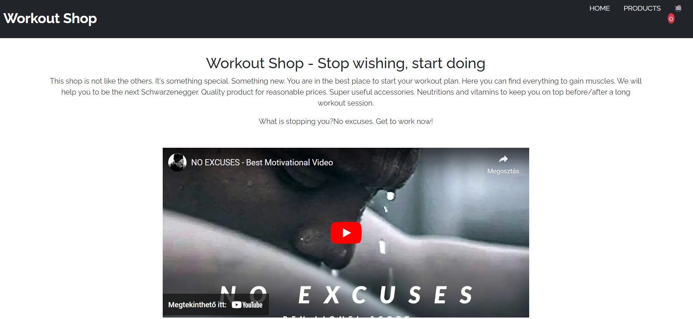
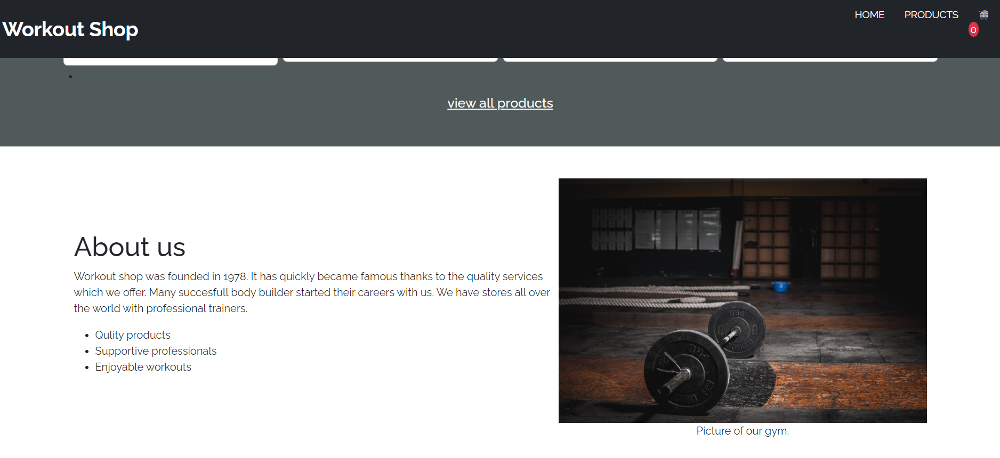
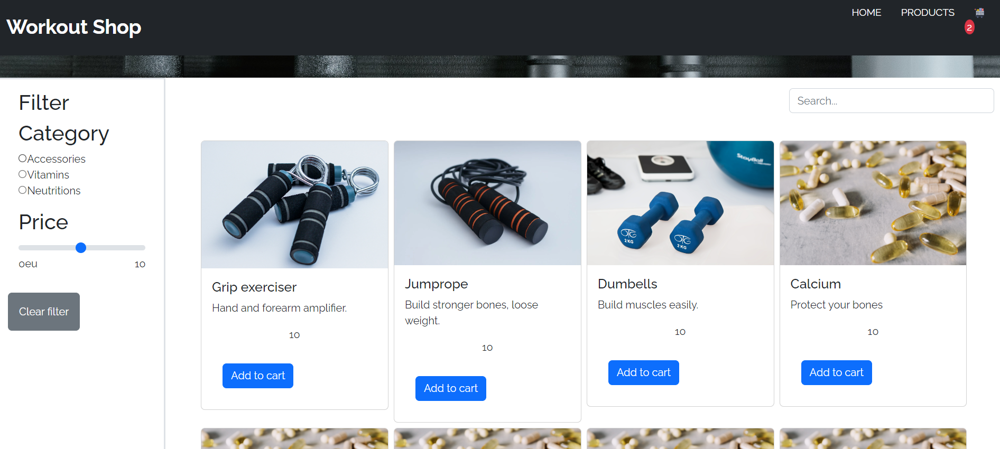
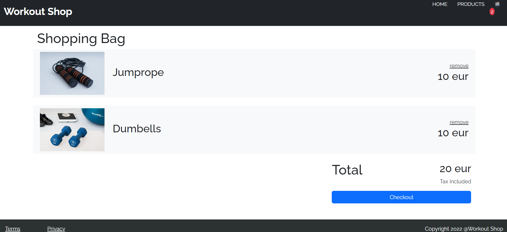

<h1>Workout Shop description/documentation</h1>
<h2>Overview</h2>
This documentation outlines the development details of an e-commerce platform tailored for workout products. The web application is built using React, providing users with a user-friendly, responsive interface for seamless browsing and purchasing of workout accessories, neutritions, vitamins.

<h2>Home Page Sections</h2>
On the home page the user can view different sections by scrolling down:
<li>Introduction</li>
Welcoming users with a brief motivational paragraph and an inspiring video, the introduction section sets a positive tone, fostering a connection with visitors on their fitness journey.

<li>Items</li>
The "Items" section on the home page provides a curated display of workout products, showcasing the latest and featured items available for purchase. 
<li>About Us</li>
The "About Us" section offers users insights into the background, mission, and values of the workout e-commerce platform. This section aims to build trust and familiarity with the brand.

<li>Partners</li>
The "Partners" section highlights collaborations and partnerships with trusted brands or entities, reinforcing the credibility and quality of the workout products offered.
<li>FAQ (Frequently Asked Questions)</li>
The "FAQ" section addresses common queries and concerns users may have, offering a comprehensive resource to enhance user experience and understanding.

<h2>Products Page</h2>
The "Products" page allows users to explore the diverse range of workout items available for purchase.
Users can add items to their cart directly from the product page.
Advanced filtering options are provided, enabling users to filter products by categories and price ranges for a more personalized shopping experience.

<h2>Shopping Bag Page</h2>
The "Shopping Bag" page serves as a centralized hub for users to manage their selected items before making a purchase.
Users can view the items currently in their cart, including details such as product name, quantity, and individual prices.
Users have the opportunity to remove items from the cart.
The overall price of the items in the cart is prominently displayed, ensuring transparency and clarity for users during the checkout process.

